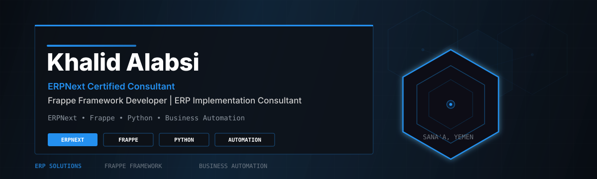

  

<h1 align="center">Khalid Alabsi</h1>

  <strong>ERPNext Certified Consultant | Frappe Framework Developer | ERP Implementation Specialist</strong> 
  <em>Helping businesses transform operations through ERPNext, Frappe Framework, and workflow automation.</em>

  
  
  

  

---

## About Me

I am an ERPNext Certified Consultant and Frappe Framework Developer with hands-on experience designing, customizing, implementing, and supporting ERPNext solutions.

I translate business requirements into scalable ERP systems through custom applications, DocTypes, workflow automation, reports, print formats, permissions, REST API integrations, deployment, and user training.

---

## Certification

<table>
  <tr>
    <td align="center" width="180">
      
    </td>
    <td>
      <strong>ERPNext Certified Consultant</strong> 
      Validated expertise in ERPNext configuration, implementation, and business process optimization.
    </td>
  </tr>
</table>

---

## Expertise

<table>
  <tr>
    <td width="25%" valign="top">
      <h3>ERPNext Development</h3>
      <ul>
        <li>Custom Apps</li>
        <li>Custom DocTypes</li>
        <li>Child Tables</li>
        <li>Hooks</li>
        <li>Client Scripts</li>
        <li>Server Scripts</li>
        <li>Reports</li>
        <li>Print Formats</li>
      </ul>
    </td>
    <td width="25%" valign="top">
      <h3>ERP Implementation</h3>
      <ul>
        <li>Requirement Gathering</li>
        <li>Business Process Analysis</li>
        <li>Process Mapping</li>
        <li>ERP Configuration</li>
        <li>Deployment</li>
        <li>User Training</li>
        <li>Post-Implementation Support</li>
      </ul>
    </td>
    <td width="25%" valign="top">
      <h3>Business Automation</h3>
      <ul>
        <li>Workflows</li>
        <li>Role-Based Permissions</li>
        <li>Notifications</li>
        <li>Dashboards</li>
        <li>REST APIs</li>
        <li>Approval Processes</li>
      </ul>
    </td>
    <td width="25%" valign="top">
      <h3>Backend Engineering</h3>
      <ul>
        <li>Python</li>
        <li>JavaScript</li>
        <li>MariaDB</li>
        <li>SQL</li>
        <li>Linux</li>
        <li>Git</li>
        <li>Bench</li>
      </ul>
    </td>
  </tr>
</table>

---

## Technical Stack

  
  
  
  
  
  
  
  
  
  
  
  
  
  
  

---

## Featured Projects

<table>
  <tr>
    <td width="50%" valign="top">
      <h3>Histopathology Laboratory ERP</h3>
      
ERPNext and Frappe customization for pathology laboratory operations, including:

      <ul>
        <li>Laboratory visits</li>
        <li>Diagnosis workflow</li>
        <li>Referral doctor management</li>
        <li>Payment and commission rules</li>
        <li>Reports and print formats</li>
        <li>Permissions and workflow automation</li>
        <li>Audit-friendly operational processes</li>
      </ul>
      
<code>ERPNext</code> <code>Frappe</code> <code>Python</code> <code>MariaDB</code>

    </td>
    <td width="50%" valign="top">
      <h3>Automotive Spare Parts ERP</h3>
      
An ERPNext implementation for an automotive spare parts retailer, including:

      <ul>
        <li>Selling</li>
        <li>Buying</li>
        <li>Inventory</li>
        <li>Accounting</li>
        <li>Business process configuration</li>
        <li>Deployment and user training</li>
      </ul>
      
<code>ERPNext</code> <code>Frappe</code> <code>Python</code> <code>Linux</code>

    </td>
  </tr>
  <tr>
    <td width="50%" valign="top">
      <h3>Enterprise WhatsApp Management Platform</h3>
      
A centralized business operations and customer communication platform built using:

      <ul>
        <li>Next.js and TypeScript</li>
        <li>Node.js</li>
        <li>PostgreSQL</li>
        <li>REST APIs</li>
        <li>Socket.IO</li>
        <li>WhatsApp integration</li>
      </ul>
      
<code>Next.js</code> <code>TypeScript</code> <code>Node.js</code> <code>PostgreSQL</code>

    </td>
    <td width="50%" valign="top">
      <h3>ERP Automation Toolkit</h3>
      
Reusable ERPNext and Frappe patterns for:

      <ul>
        <li>Workflows</li>
        <li>Reports and dashboards</li>
        <li>Notifications</li>
        <li>Permissions</li>
        <li>Approval systems</li>
        <li>REST API integrations</li>
      </ul>
      
<code>ERPNext</code> <code>Frappe</code> <code>Python</code> <code>JavaScript</code>

    </td>
  </tr>
</table>

---

## Services

<table>
  <tr>
    <td align="center" width="50%">
      
    </td>
    <td align="center" width="50%">
      
    </td>
  </tr>
  <tr>
    <td align="center" width="50%">
      
    </td>
    <td align="center" width="50%">
      
    </td>
  </tr>
  <tr>
    <td align="center" width="50%">
      
    </td>
    <td align="center" width="50%">
      
    </td>
  </tr>
  <tr>
    <td align="center" width="50%">
      
    </td>
    <td align="center" width="50%">
      
    </td>
  </tr>
  <tr>
    <td align="center" width="50%">
      
    </td>
    <td align="center" width="50%">
      
    </td>
  </tr>
</table>

---

## GitHub Analytics

  
  

  
  

---

## Developer Philosophy

> Great ERP systems are built by understanding people, processes, and business goals before writing a single line of code.

I focus on building reliable, maintainable, scalable, and user-friendly ERP systems. Every implementation starts with understanding the business, followed by designing solutions that solve real operational challenges.

---

  

  <strong>Building scalable ERPNext solutions that simplify operations, automate workflows, and help businesses grow.</strong>

